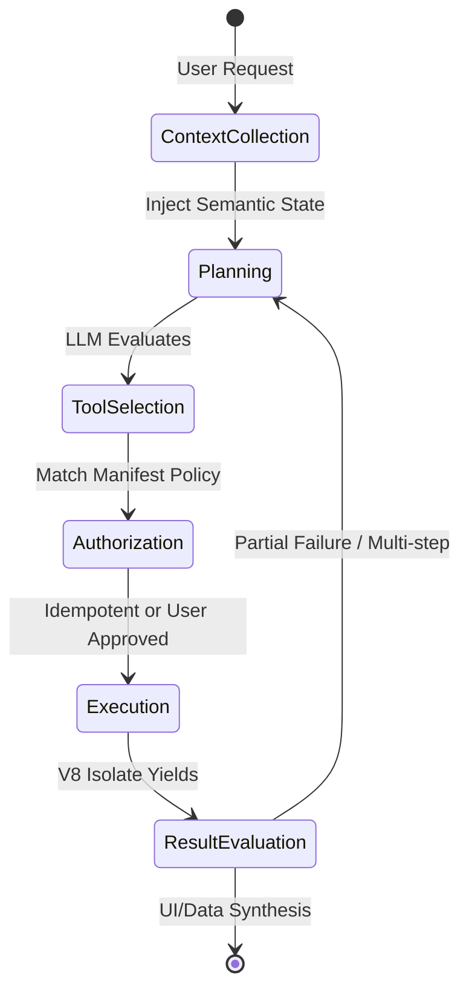

# PHASE 13 ADDENDUM — AI OPERATIONS & LIFECYCLE

*Integrating operational feedback to ensure the AI Agent architecture is resilient, observable, and strictly abstracted from specific model providers.*

### 1. Agent Execution Lifecycle
The complete operational flow of an AI-driven interaction:

### 2. Provider Abstraction Layer
The Host does not hardcode vendor-specific schemas (e.g., OpenAI vs. Anthropic formats). 
*   **Internal IR:** The Host parses `manifest.json` into a normalized **Internal Tool Schema**.
*   **Adapters:** At inference time, Provider Adapters (e.g., `AnthropicAdapter`, `OpenAIAdapter`, `LlamaCppAdapter`) translate the Internal Schema into the exact dialect expected by the active model, ensuring the platform remains provider-agnostic.

### 3. Context Lifecycle & Retention Policy
*   **Registration:** Extensions register as context providers via `@supersearch/api`.
*   **Expiration (TTL):** Context state expires if the extension transitions to `Unloaded`.
*   **Token Quotas:** The AgentController maintains a strict context budget (e.g., max 16k tokens). 
*   **Priority & Conflict Resolution:** Foreground context (e.g., active IDE file) inherently overrides background context (e.g., paused Chrome tab). The LRU (Least Recently Used) background context is evicted first when the budget is reached.

### 4. Multi-Step Orchestration
*   **Parallel Execution:** If the LLM requests multiple independent tools (e.g., `github.search` AND `linear.search`), the Rust Host spawns/resumes the respective V8 isolates concurrently.
*   **Partial Failures:** If a tool panics or returns a `NetworkError`, the Host catches the error and feeds it back into the LLM context (`Tool execution failed: <Reason>. Try alternative arguments.`), enabling autonomous recovery.

### 5. Authorization & Persistence Policies
Idempotency defines the default, but users can configure overrides:
*   `Always ask`: Strict enforcement.
*   `Session-only approval`: Approves mutative actions for a specific tool for the next 60 minutes.
*   `Always allow`: Persisted in SQLite.
*   `Enterprise overrides`: Organizations can deploy an MDM profile that hard-blocks specific extensions from being utilized by the AI.

### 6. AI Observability & Telemetry
The observability SQLite database aggregates specific agentic metrics:
*   `tool_selection_latency_ms`: Time taken by the LLM to decide on a tool.
*   `tool_success_rate`: Percentage of executions that yield successful data vs. errors.
*   `model_escalation_rate`: Frequency of Local Router failing over to the Cloud Reasoner.
*   `approval_frequency`: Tracks user fatigue (how often users are prompted for authorization).

### 7. Fallback Behavior
If the user's internet drops or the Cloud Reasoner API experiences an outage:
*   The Host immediately halts cloud-bound requests.
*   The system fails over entirely to the Local Inference Engine (e.g., Llama 3 8B).
*   A Native UI badge is rendered (`Offline Mode - Degraded Reasoning`), alerting the user that complex multi-step orchestration may fail, but basic local context and tool routing remain operational.
